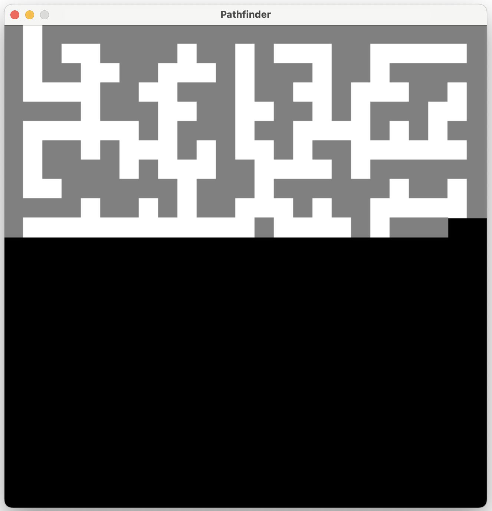
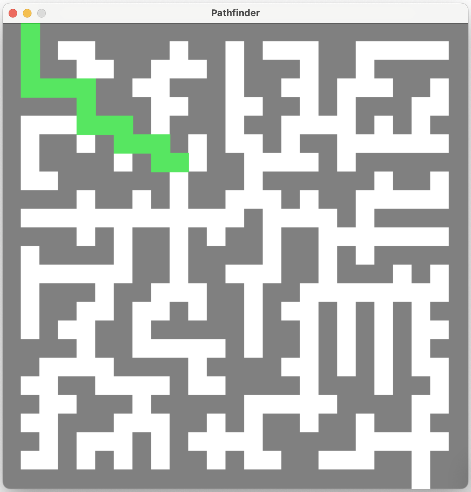

# Pathfinder :compass:

- [Visual Tour](#visual-tour)
   - [Live Demo](#live-demo)
   - [Generating a Maze](#maze-generation)
   - [Finding a Path](#finding-a-path)
- [Try out Pathfinder](#try-out-pathfinder)
- [Attributions](#attributions)

----

Embark on a journey of discovery and strategy with Pathfinder, the premier maze exploration and solving experience designed for the curious and the clever.

Pathfinder elevates the timeless intrigue of mazes, offering an interactive platform where you control the complexity of the challenge ahead. Experience the creation of your maze in real-time, as its design intricately unfolds before you, presenting a blend of complexity and intrigue. Witness as Pathfinder charts a clear path through the labyrinth, marking your route to success with a distinctive green line from start to finish.

Designed for thinkers, strategists, and anyone with a penchant for puzzles, Pathfinder elevates the classic maze experience into a visually captivating and intellectually stimulating adventure.

## Visual Tour

### Live Demo

https://github.com/isobarbaric/VocabVoyager/assets/76544615/8f10d0d4-0d9d-4079-b123-071a24a7d203

### Maze Generation



### Finding a Path



## Try out Pathfinder

There are two primary ways to go about trying this project out: either through cloning the project or downloading one of the releases for this project.

Once either of those are done, if you decide to run the source code itself, and not the ``.exe`` or ``.dmg`` from the releases, simply follow the following steps to get started.

### Running the Source Code

```
git clone https://github.com/isobarbaric/Pathfinder.git
cd Pathfinder
python main.py
```

### Getting an Executable File to Run Directly

To get an executable to run directly without having to deal with source code, visit the releases section (LINK) on this repository and there, according to the operating system you are using, the corresponding file can be downloaded - either .exe for Windows or .dmg for Mac users. After downloading either of these, simply clicking on them will run the project directly!

## Attributions

In this project, I did make use of some open-source code and so above all, crediting these people for their work is of the utmost importance.

Thanks to these people, this project was possible:
  1. https://github.com/OrWestSide/python-scripts/blob/master/maze.py
  2. https://medium.com/swlh/fun-with-python-1-maze-generator-931639b4fb7e
